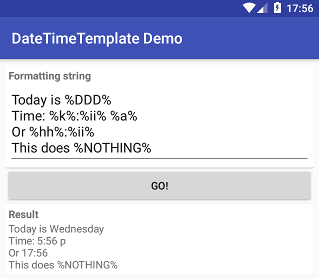

DateTimeTemplate
================
 `DateTimeTemplate` is date/time formatting library supporting formatting placeholders.

 Download demo application APK from [releases](https://github.com/MarcinOrlowski/datetimetemplate/releases)
 section. Source code in project's `app/` module.

## Features ##

 * Easy to use,
 * Stable and production ready,
 * Localization support,
 * Lightweight,
 * No extra dependencies.

Installation
============

 Edit your master `gradle.build` file and **add** `maven { url 'https://jitpack.io' }` to your current
 `repositories` block content (if you use other jitpack hosted libraries, then this step can be skipped):

    allprojects {
      repositories {
        maven { url 'https://jitpack.io' }
        }
    }
    
 
 Next, edit your **module**'s `build.gradle` and the following dependency:

    compile 'com.github.MarcinOrlowski:datetimetemplate:<VERSION>'

 For recent value of `<VERSION>` consult [library releases](https://github.com/MarcinOrlowski/datetimetemplate/releases)
 or jitpack badge: 

Placeholders
============

 Your formatting string can contain anything you like, however certain sequences are considered
 placeholders, and will be replaced by corresponding values. Non-placeholders are returned
 unprocessed

| Placeholder | Description |
|-------------|-------------|
| %Y% 		| long year (i.e. "2010") |
| %y% 		| short year (i.e. "10") |
| %MMM%	| long month name (i.e. "January") |
| %MM%		| abbreviated month name (i.e. "Jan") |
| %M%		| first letter of month name (i.e. "J") |
| %mm%		| zero prefixed 2 digit month number ("02" for Feb, but "12" for Dec) |
| %m%		| month number as is ("2" for Feb, "12" for Dec) |
| %DDD%	| full day name (i.e. ""Saturday", "Sunday", "Monday") |
| %DD%		| abbreviated day name ("Sat", "Sun", "Mon") |
| %D%		| one letter day name ("S", "S", "M") |
| %dd%		| zero prefixed 2 digit day number ("01", "27") |
| %d%		| day number as is ("1", "27") |
| %dy%		| day number of the year (i.e. "250") |
| %dw%		| day number in week (i.e. "1" for Monday **if** weeks start on Mondays!) |
| %wm%		| week number of current month ("3" for 3rd week) |
| %wy%		| week number of the year ("3" for 3rd week, 47 for 47th) |
| %hh%		| current hour, zero prefixed, 24hrs clock (i.e. "01", "16") |
| %h%		| current hour, 24hrs clock (i.e. "1", "16") |
| %kk%		| current hour, zero prefixed, 12hrs clock (i.e. "01", "11") |
| %k%		| current hour, 12hrs clock (i.e. "1", "11") |
| %ii%		| current minute, zero prefixed (i.e. "01", "35") |
| %i%		| current minute, zero prefixed (i.e. "1", "35") |
| %AA%		| uppercased AM/PM marker (i.e. "AM") |
| %A%		| uppercased abbreviated AM/PM marker. "A" for "AM", "P" for "PM" |
| %aa%		| lowercased am/pm marker (i.e. "am") |
| %a%		| lowercased abbreviated AM/PM marker. "a" for "am", "p" for "pm" |

Examples
========

 Format current date, time as it is in `GMT` zone, using 24hrs clock format:

    TimeZone tz = TimeZone.getTimeZone("GMT");
    Calendar c = new GregorianCalendar(tz);
    c.setTime(new Date());
    
    String formatted = DateTimeTemplate.format(c, "GMT: %DD% %hh%:%ii%");

 would produce  `GMT: Mon 16:25`.

 Format current time as it is in `Pacific Daylight Time` zone (`PDT` is 7 hours behind `GMT`), 
 using 12hrs clock format with abbreviated AM/PM marker:

    TimeZone tz = TimeZone.getTimeZone("GMT-0700");
    Calendar c = new GregorianCalendar(tz);
    c.setTime(new Date());
    
    String formatted = DateTimeTemplate.format(c, "Time: %k%:%ii%%a%");

 would produce `Time: 3:25a`.

 Format current time using device's time zone:

    TimeZone tz = TimeZone.getDefault();
    Calendar c = new GregorianCalendar(tz);
    c.setTime(new Date());
    
    String formatted = DateTimeTemplate.format(c, ...);

 Formatting using locale of your choice:

    String formatted = DateTimeTemplate.format(cal, "Time: %k%:%ii%%a%", Locale.SIMPLIFIED_CHINESE);

Project support
===============

 `DateTimeTemplate` is free software and you can use it fully free of charge in any of your projects, open source or 
 commercial, however if you feel it prevent you from reinventing the wheel, helped having your projects done or simply
 saved you time and money  then then feel free to donate to the project by sending some BTC to 
 `1LbfbmZ1KfSNNTGAEHtP63h7FPDEPTa3Yo`.

 

Contributing
============

 Please report any issue spotted using [GitHub's project tracker](https://github.com/MarcinOrlowski/datetimetemplate/issues).
 
 If you'd like to contribute to the this project, please [open new ticket](https://github.com/MarcinOrlowski/datetimetemplate/issues) 
 **before doing any work**. This will help us save your time in case I'd not be able to accept such changes. But if all is good and 
 clear then follow common routine:

 * fork the project
 * create new branch
 * do your changes
 * send pull request

License
=======

 * Written and copyrighted &copy;2013-2017 by Marcin Orlowski <mail (#) marcinorlowski (.) com>
 * DateTimeTemplate is open-sourced software licensed under the [MIT license](http://opensource.org/licenses/MIT)
